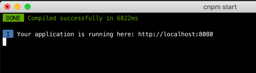

# Boat House（船屋餐饮系统）—— Web前端

> 包含用户操作界面 和 管理员操作界面


## 文档目录

+ [1. 说明](#1.%20说明)
+ [2. 目录结构](#2.%20目录结构)
+ [3. 开发/调试环境配置](#3.%20开发/调试环境配置)
  + [3.1. MAC](#3.1.%20MAC)
  + [3.2. Windows](#3.2.%20Windows)
+ [4. 调试](#4.%20调试)
+ [5. 测试](#5.%20测试)
5. 以docker容器方式在本地运行
+ [6. DevOps](#6.%20DevOps)
+ [常见问题](#常见问题)


## 1. 说明
+ dev.env.js            
开发环境配置文件，在开发终端修改这个文件进行开发，提交前要改回IDCF社区的dev环境配置
+ 沿用vue-element-admin做法，新增内容拆成modules。减少对index.js的修改
+ 按照业务功能把每个页面放在view下面，如果页面较小，可以将增删改查功能放在一个文件中；如果页面较大，可以拆成多个模块，页面单独使用的模块放在view目录下。
+ 所有请求后端的api封装文件放在src\api下面。按照业务模块划分目录存放。业务模块命名要与view下面业务模块一致
+ 命名规则
    * 项目命名：全部采用小写方式， 以下划线分隔。 例：my_project_name
    * 目录命名：有复数结构时，要采用复数命名法。例：scripts、styles、images、data_models
    * 组件名：components组件命名使用大驼峰(KebabCase)TodoItem.vue，组件名为多个单词，这样做可以避免跟现有的以及未来的 HTML 元素相冲突，因为所有的 HTML 元素名称都是单个单词的。
    * 页面名：views目录下，页面命名使用连接符(kebab-case)user-info.vue，如果views下的文件件只有一个文件,命名使用index.vue 。
    * JS文件命名：名使用分隔符线resize-event.js，如果为单个单词，使用小写md5.js

 
## 2. 目录结构
```
├── images                              # 代码库中饮用图片的统一存放文件夹
├── src                                 # 代码文件
│   ├── client                          # 用户操作界面
│   │   ├── build
│   │   ├── config
│   │   │   ├── dev.env.js              # 开发环境配置文件
│   │   │   ├── index.js                # webpack相关
│   │   │   ├── prod.env.js             # 生产环境配置文件，一idcf社区为准不建议修改
│   │   │   ├── test.env.js             # 测试环境配置文件，一idcf社区为准不建议修改
│   │   ├── mock                        # 项目mock 模拟数据
│   │   ├── plop-templates              # 基本模板
│   │   ├── src                         # 源代码
│   │   │   ├── assets                  # 主题 字体等静态资源
│   │   │   │   ├── css                 # 样式文件
│   │   │   │   ├── js                  # 公用JS文件
│   │   │   │   ├── font                # 字体
│   │   │   │   ├── img                 # 图片
│   │   │   │   ├── plugins             # 前端插件
│   │   │   ├── components              # 全局公用组件
│   │   │   ├── router                  # 路由
│   │   │   │   ├──index.js             # 路由配置文件
│   │   │   │   ├──modules              # 存储各个模块的路由信息
│   │   ├── test                        # 测试
│   │   ├── .env.xxx                    # 环境变量配置
│   │   ├── .eslintrc.js                # eslint 配置项
│   │   ├── .babelrc                    # babel-loader 配置
│   │   ├── .travis.yml                 # 自动化CI配置
│   │   ├── vue.config.js               # vue-cli 配置
│   │   ├── postcss.config.js           # postcss 配置
│   │   └── package.json                # package.json
│   └── management                      # 与 client 类似  
├── test
│   ├── jmeter
│   ├── selenium
│   │   └── dotnet-uitest
│   ├── unit-test
│   │   ├── client-test
│   │   └── management-test
```

注意：为保证站点的加载速度
1. 站点中的图片尽量配置清晰度为80%，图片大小控制在500kb以下
2. 静态资源本地话，即插件放在plugin，公用的静态资源可以放在assets对应的文件夹下

## 3. 开发/调试环境配置
### 3.1. MAC

安装brew， 如果update速度慢，请 [参考](#1.解决brew安装速度慢的问题) 
``` bash
/usr/bin/ruby -e "$(curl -fsSL https://raw.githubusercontent.com/Homebrew/install/master/install)"
brew update
brew install
```

安装
``` bash
# 安装cnpm & node
brew install cnpm
cnpm install node

# 查看版本
cnpm -v
node -v

# 安装Vue
cnpm install vue  

# 全局安装 vue-cli
cnpm install --global vue-cli
```

### 3.2. Windows
下载node.js安装 https://nodejs.org/en/download

``` cmd
# 基于 Node.js 安装cnpm（淘宝镜像）
npm install -g cnpm --registry=https://registry.npm.taobao.org

# 安装Vue
cnpm install vue -g

# 安装vue命令行工具，即vue-cli 脚手架
cnpm install vue-cli -g
```

## 4. 调试
``` bash
# 进入web 用户界面文件夹
cd /src/client

# 安装依赖包
cnpm install

# 启动
cnpm start
```



## 5. 测试
以docker容器方式在本地运行

`docker-compose -f src/docker-compose.yml up -d`

## 6. DevOps
### Jenkins
[点击这里](/devops/jenkins/jenkinsfile)
### GitHub Action
[前台页面](/.github/workflows/client.yml)

[后台页面](/.github/workflows/management.yml)

## 常见问题
### 1. 解决brew安装速度慢的问题

> 使用阿里云的git库， 替换homebrew镜像源
    
替换brew.git:
``` 
cd "$(brew --repo)”
git remote set-url origin https://mirrors.aliyun.com/homebrew/brew.git
```
 替换homebrew-core.git:
``` 
cd "$(brew --repo)/Library/Taps/homebrew/homebrew-core"
git remote set-url origin https://mirrors.aliyun.com/homebrew/homebrew-core.git
```
