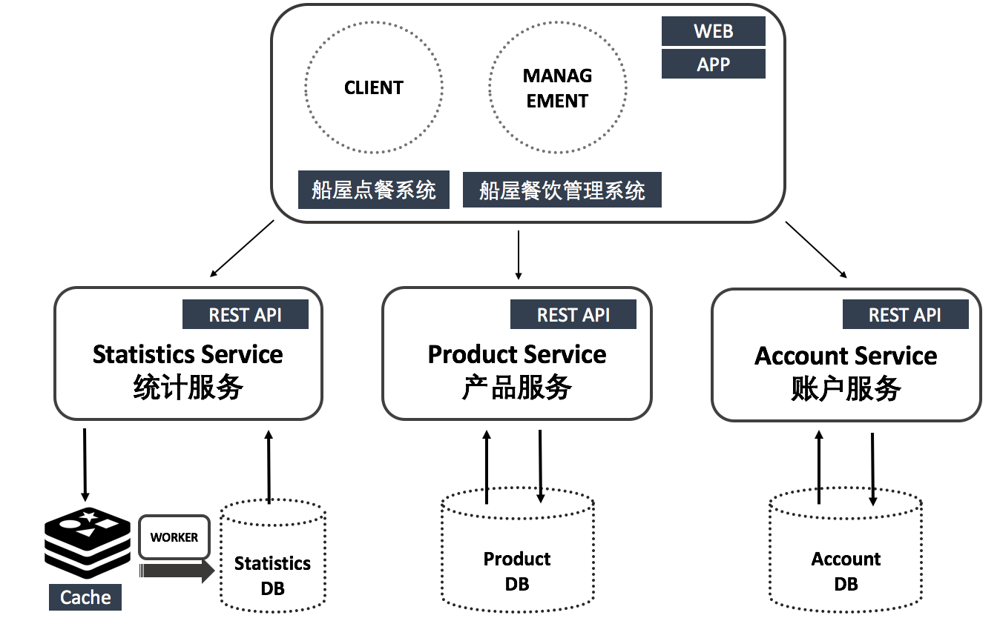
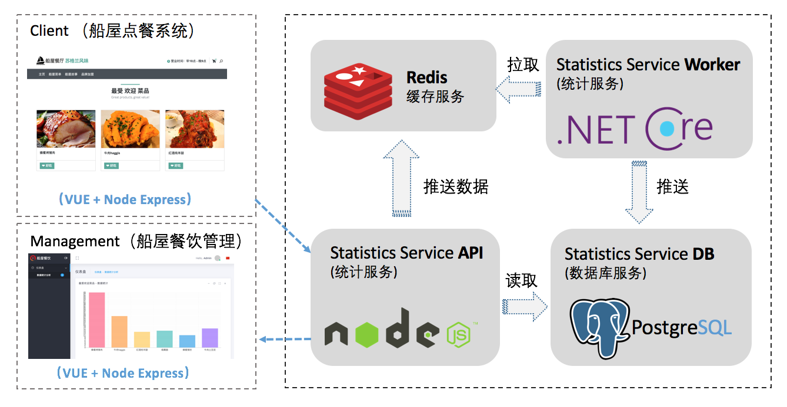
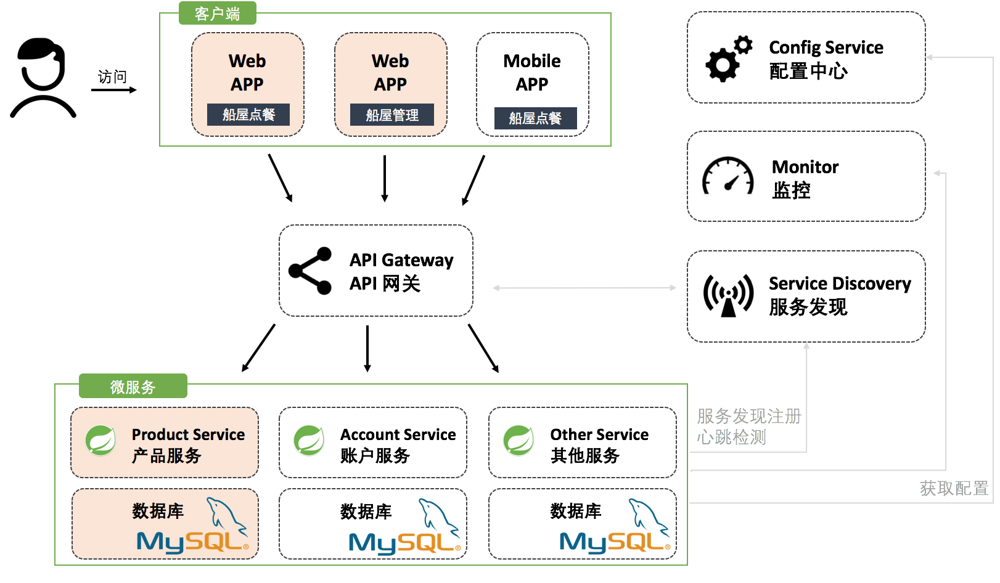

# Boat House（船屋餐饮系统）—— 服务端

+ [1. 架构设计](#1.%20架构设计)
    + [1.1. Statistics service 统计服务](#1.1.%20Statistics service 统计服务)
    + [1.2. Product service 产品服务](#1.2.%20Product service 产品服务)
    + [1.3. Account service 账户服务](#1.3.%20Account service 账户服务)
    + 1.4. 订单服务（暂未实现，期待你的参与）
    + 1.5. 支付服务（暂未实现，期待你的参与）
+ 目录结构
+ 本地环境配置
+ 本地开发调试
+ DevOps
+ 常见问题 

## 1. 架构设计
船屋餐饮系统采用微服务架构设计，包含五条业务条线（统计服务、商品服务、账户服务、订单服务、支付服务），每一个业务条线可以独立的开发以及部署

| 服务  | 服务说明 | 技术架构 |
| ------------ | ------------ |------------ |
| product-service  | 业务条线 - 产品服务  |spring boot + mysql |
| account-service  | 业务条线 - 账户服务  |spring boot + mysql |
| order-service  | 业务条线 - 订单服务  |spring boot + mysql |
| payment-service  | 业务条线 - 支付服务  |spring boot + mysql |

### 1.1. Statistics service 统计服务

统计最受欢迎的菜品，并通过图表实时展示统计结果。

### 1.2. Product service 产品服务

进行菜品管理、菜品分类管理

### 1.3. Account service 账户服务

TODO

## 2. 本地环境配置
参考：https://code.visualstudio.com/docs/java/java-spring-boot

先决条件
Java Development Kit (JDK), version 1.8. https://www.oracle.com/java/technologies/javase-jdk14-downloads.html
Apache Maven, version 3.0 or later. 
Java Extension Pack

### IntelliJ IDEA
https://www.jetbrains.com/idea/download/
选择社区免费版 下载
  
 

java

spring boot

mysql

## 3. 本地开发调试

本项目采用容器的方式进行编译、打包、以及运行，客户端安装Docker以及Docker-compose工具后可以一键运行此应用。

`
docker-compose up -d
`

## 4. DevOps

### DevOps 工具链

本项目使用JIRA进行项目管理、Github代码管理、Jenkins持续集成、Nexus进行包管理以及容器镜像管理、Jemeter进行接口测试以及压力测试、Selenium进行自动化UI测试。下图是本项目的持续交付流水线架构：

### ChatOps && AIOps

本项目将支持ChatOps && AIOps，让开发、测试、客户可以在IM即时通讯工具里以聊天的方式完成相应的工作。

### DevOps工具链环境 示例

| 地址  | 说明  | 
| ------------ | ------------ | 
| http://jenkins.devopshub.cn  | Jenkins管理端  |
| http://tools.devopshub.cn:8081 | Nexus  | 
| http://tools.devopshub.cn:9000| Sonarqube|
| http://tools.devopshub.cn  | Jira  |

