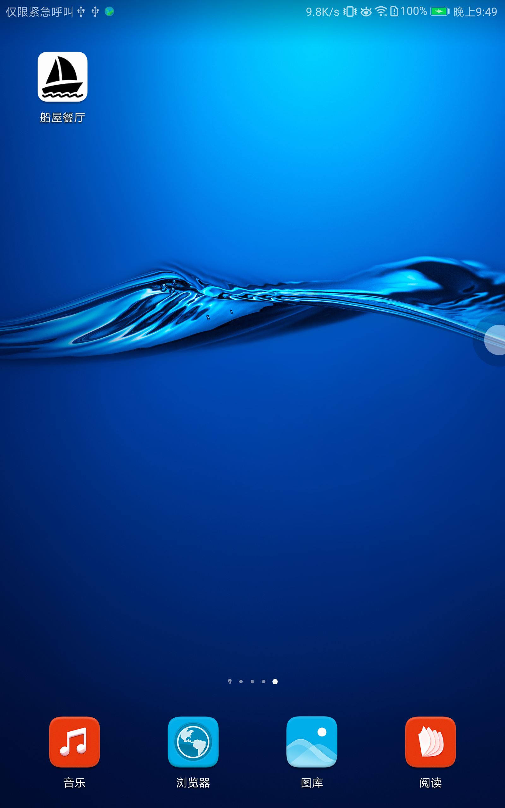
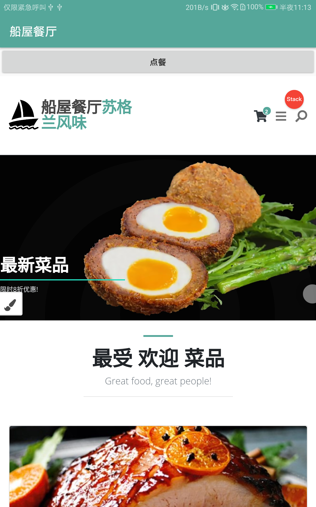
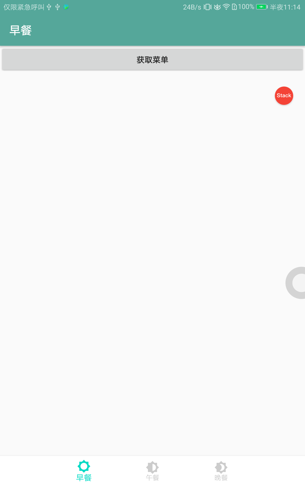
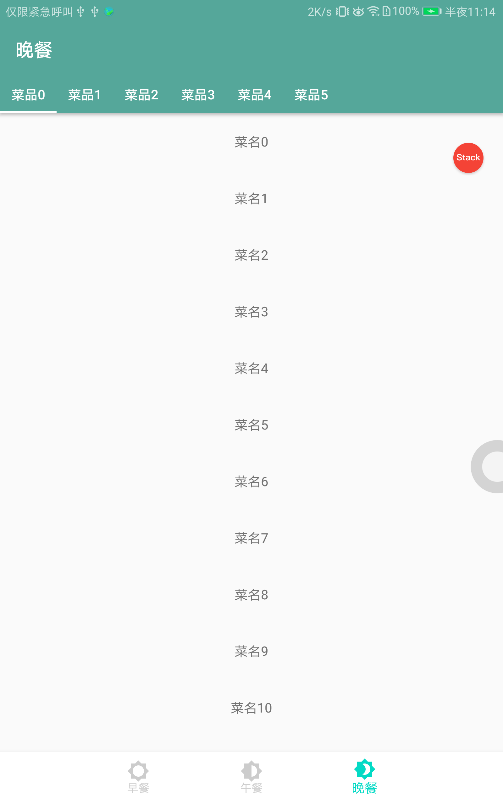
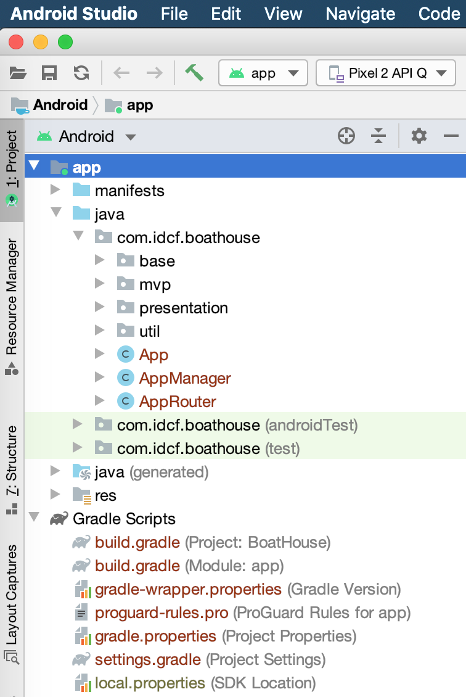

# boat-house-app（船屋餐饮系统移动端）

## AndroidNativeApp（安卓原生App版本）

IDCF Boat House 移动端

## 功能定位

船屋餐饮系统移动端目前采用AndroidNativeApp（安卓原生App版本） MVP架构设计。

主要用于在移动端对船屋餐饮系统进行浏览、点赞、点餐等操作。

## 平台定位

Android.

## Features

* Fragment.
* WebView.
* MVP.

## Logo && 预览

## 开发环境

Android Studio

* Gradle版本:3.6.1

## 目录介绍

* --base Activity & Fragment Base类
* --mvp MVP的Base类都在这里面
* --presentation 主要包，其中的Contract类是定义View和Presenter接口的地方
* --util 通用工具包
* App Application
* AppRouter App路由，界面跳转帮助类，所有的界面跳转通过此类进行跳转,包括组件交互

