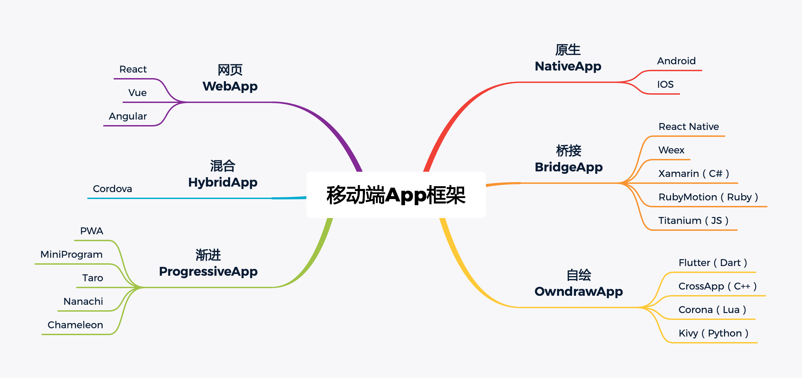

# 移动APP开发框架盘点
 

## 总体概述
现在比较流行的移动APP开发框架有以下六种：网页、混合、渐进、原生、桥接、自绘。前三种体验与Web的体验相似，后三种与原生APP的体验相似。这六种框架形式，都有自己适用的范围。无所谓好坏，适用就是好。

 

l  网页应用适用于传统网站APP化，比如淘宝、京东，有大量WEB页面嵌入到APP中。

l  混合应用适用于小成本应用开发，全部代码都基于Web，好处是开发快速、成本低。

l  渐进应用适用于高机会成本的场合，边下载边使用，能快速获取，快速体验。

l  原生应用适用于大型和高体验要求的应用，能做出让人满意的体验效果。

l  桥接应用适用于高速迭代的创意类应用，让体验与成本都处于可接受的范围。

l  自绘应用适用于游戏和有特殊效果的应用，最大的好处是没有平台约束和表达瓶颈。

 

## 一、网页WebApp
WebApp与传统Web的主要区别，在于前端框架，特别是V-DOM框架的应用。此类前端框架使得WebApp与NativeApp在机理上已经没有任何区别了。在众多的前端框架中， React、Vue和Angular是最有竞争力的选择。

### React
V-Dom技术的开创者，主流框架中的NO.1。React的贡献都是开创性的，在它基础上，也有很多兼容框架，比如Anu，Nerv。用以解决React在性能或IE兼容性上的问题。

主流技术方案：

React + Redux + ReactRouter + Material-UI/AntD/Semantic-UI

 

### Vue
由国人创建，在中国拥有大量使用者，也有很多配套的开源项目。它的是要特点是学习成本低，容易上手。

主流技术方案：

Vue + Vuex + Vue-Router + Vuetify/Quasar/vux/ Mint-UI

 

### Angular
大而全型的框架，为大型项目所推崇，深度整合Typescript和Rxjs。

主流技术方案：

Angular + Typescript

 

## 二、原生NativeApp
由于操作系统的限制，原生应用只有那么几种。对于原生应用，架构是基础，框架是核心，加上海量的UI组件。

 

### IOS
iOS开发已经从OC全面转向Swift，最新的架构VIPER基本上可以视为MMVPP。

主流技术方案：

VIPER + RxSwift + Moya + Alamofire + SwiftyJSON/ObjectMapper

 

### Android
Android开发语言从Java更换为Kotlin。编译时依赖注入框架Dagger也成为不二法宝。

主流技术方案：

MVP + Dagger + RxKotlin + Retrofit + OkHttp + Kotson（Gson）

 

## 三、混合HybridApp
HybridApp的关键不在本身，而在WebApp。好的WebApp改为HybridApp很容易。所以混合应用框架实际是指WebApp的基础设施库，有Cordova（PhoneGap）就足够了。

 

### Cordova
PhoneGap开源而来。

官方网站：

https://cordova.apache.org/

 

## 四、桥接BridgeApp
桥接应用的特点在于使用原生界面，但应用逻辑使用脚本语言编写，通用桥接来控制原生界面。这样达到使用脚本编写原生应用的目的，甚至可以网页与原生应用使用同一套代码，节省大量开发成本。但是操作手感比网页应用强不少。

ReactNative与Weex代表了两种不同的思路。ReactNative提供工具，将平台差异化开放出来（Learn Once, Write Anywhere）；而Weex提供框架，将平台差异化屏蔽（Write Once, Run Everywhere）。所以ReactNative最大的痛点是使用难度大，必须熟悉所有平台；Weex则注定功能相对弱小，并且坑比较多。

 

### React Native
React的大热，实际始于ReactNative的发布。

官方网站：

https://facebook.github.io/react-native/

 

### Weex
小众的框架，能不能壮大，关键在于学习者是否能有效率地编写应用。所以很多人认为文档是决定一个开源框架生死的关键。其实有几个使用框架的开源应用，比文档还要关键。因为这些应用活着，间接地证明了框架还有生存的价值和能力，也能成为更好的文档教材。Weex号称有一堆知名的应用，但开源项目就乏善可陈了。

官方网站：

http://weex.apache.org/

 

### Xamarin（C#）
Xamarin在IOS与Android中的实现方式不一致，在IOS中是AOT直接编译，在Android中是使用桥接技术。

官方网站：

http://xamarin.com/

 

### RubyMotion（Ruby）
动态语言编写移动应用，对语言社区而言是能力问题，必须要证明语言的优越性和无所不能。但除开狂热爱好者，正确的做法是使用最有效率的平台和语言。Ruby的长处在于Web后端，所以编写APP并无多少继承性，编写效率也由于太过小众而存在掉坑的风险。有免费版本，但只支持最新的操作系统版本。

官方网站：

http://www.rubymotion.com/

 

### Titanium
这个框架的核心就是使用JavaScript开发应用，与Web开发的在形式上区别很大。所以从根本上，这就是一种脚本语言框架，和RubyMotion如出一辙。

官方网站：

http://www.appcelerator.com/

 

## 五、自绘OwndrawApp
自绘一直以来都是游戏界面的势力范围，事实上除开Flutter，其它的框架都是偏游戏开发的。所以Flutter的横空出世，吸引了很大的关注，毕竟这是真正跨平台的唯一可行方案。

 

### Flutter（Dart）
除了使用Dart语言有些争议外，Flutter是真正值得关注的跨平台方案，没有之一。最近它的目标平台除开iOS 和 Android，Flutter Desktop Embedding项目将Flutter引入到桌面操作系统，Hummingbird项目将 Flutter 应用引入浏览器。它利用 Dart 平台的特性不仅可以编译原生 ARM 代码，还可以编译JavaScript 。这使得 Flutter 代码可以在基于标准的 Web 上运行而无需任何更改。

官方网站：

https://flutter.dev/

 

### CrossApp（C++）
CrossApp是基于Cocos2d-x引擎的，而Cocos2d-x是基于OpenGL的 。9秒社团是由手游社区发展而来的，由此可见CrossApp的背景，使用C++开发也有一些忠实拥趸。

官方网站：

https://crossapp.9miao.com/

 

### Corona（Lua）
更适合做游戏，不适合做应用程序，主要是因为界面部分，官方提供的UI部分代码非常不好用，自己实现又很耗时耗力。

官方网站：

https://coronalabs.com/

 

### Kivy（Python）
又一个动态语言开发框架，和游戏引擎结合起来使得它在特定领域还是很有市场的。而且它还跨windows平台，可以在windows下直接运行，可以真正实现跨平台运行。

官方网站：

https://kivy.org/

 

## 六、渐进ProgressiveApp
渐进有边下载边使用这一层意思，也有下载完成后不依赖网络这一层意思。从类型上来讲，有Google主导的PWA（ProgressiveWebApp），还有微信主导的小程序。相比PWA一统天下的野心，小程序明显是实用主义导向，能用就好，没有长远的布局。急于与微信竞争的百度、支付宝、中国九大手机厂商联盟的QuickApp也复制了这种风格。随着各种跨平台转译工具（如Taro）的兴起，各个小程序平台也随之变成了一个专有浏览器实现，变成了前端千框万架大战中的小小注脚了。

 

### PWA
全称Progressive Web App，即渐进式网页应用。相对于国内厂商的私有平台，谷歌主导的PWA从一开始就瞄准下一代浏览器标准。与传统网页最大的不同，是引入了Service Worker了，相当于本地服务器，能在离线时替代网站服务器继续工作。除此之外，PWA大致就是一个SPA（single page web app），开放标准的继承性还是比较高的。不过由于各平台厂商（如微软，苹果）对PWA的态度不明，PWA的推广进展缓慢。

 

### MiniProgram
微信小程序，由于微信的体量与使用频度，使得小程序可以承载足够的野心。不过从技术上讲，也就是个使用人数较多的浏览器实现。小程序和大量的跟随者，促使多端统一框架也发展起来了。

官方网站：

https://mp.weixin.qq.com/

 

### Taro
React兼容的跨平台多端统一开发框架。一键生成可以在微信/百度/支付宝/字节跳动小程序、H5、React Native等端运行的代码。虽然多端统一框架看似可以在不同类型的平台运行，但它还是要依赖那些平台工具，还是寄居之上的小程序而已。

官方网站：

https://taro.aotu.io/

 

### Nanachi
司徒正美开发的React兼容Anu框架的多端转译脚手架。但是对比Taro是一堆工具打包而成，nanachi仅是一个脚手架，未免寒酸。不包装一下？

官方网站：

https://rubylouvre.github.io/nanachi/

 

### Chameleon
类Vue的跨平台多端统一开发框架。专门拜读了昨天出炉的《Chameleon原理详解：其它跨多端统一框架都是假的？》。它有神奇的多态组件，就是重新定义了一个组件声明框架；严格全面的检查，不会不让你的代码不能不跨平台；更多的适配代码，听说有后端统一接口，而且还有一个后台管理系统。好吧，祝您玩得愉快。

官方网站：

https://cmljs.org/

 

# 趋势分析
国内由于微信开放了小程序流量主的广告收入，引爆了小程序的热潮，进一步催生了多端转译框架。但是这些框架所做的事并不多，引擎还是React/Vue，做了一套各平台统一的UI组件而已。由于个性化的原因，UI组件是大家一直都想统一，而不能如愿的目标。Taro框架也只是推销了自己的一套UI组件而已。在我看来，还不如提供一套组件“标准”，允许并鼓励用户自己实现。

如果有一套能在React/Vue，ReactNative/Weex，甚至Android，iOS，Flutter上使用的“标准”组件，那么全平台大一统，Write Once, Run Everywhere这个目标才有可能实现吧。