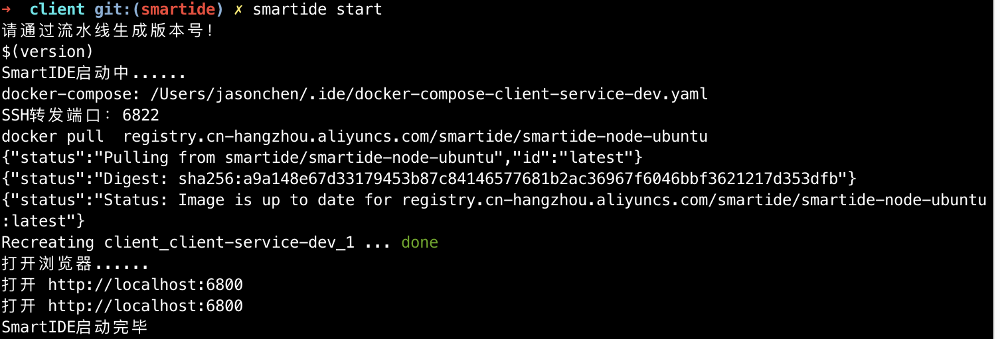
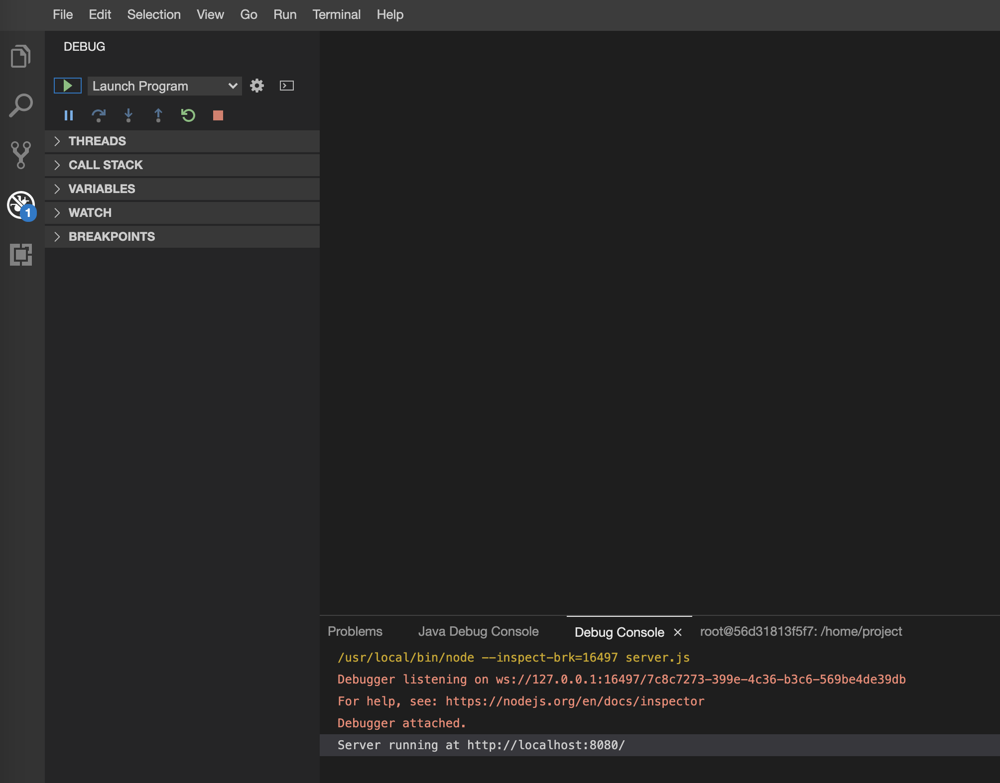
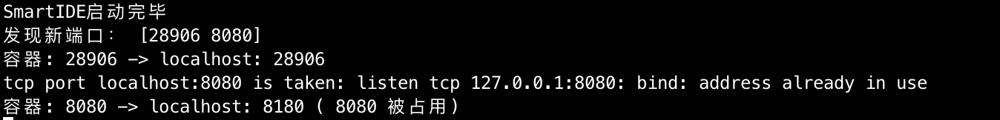

# 快速开始

安装smartide，参考 https://smartide.dev/zh/docs/getting-started/install/

```
git clone https://github.com/idcf-boat-house/boat-house-frontend.git
cd boat-house-frontend/src/client
smartide start
```

如下图所示，代表启动成功



# 开发调试
1. 在浏览器中，点击 terminal ，点击 new terminal， 在打开的 terminal 窗口中运行 “npm i”，直至运行结束


2. 点击窗口左侧的debug按钮，点击“绿色播放按钮”，进入调试



# 配置文件
[.ide.yaml](.ide.yaml)
